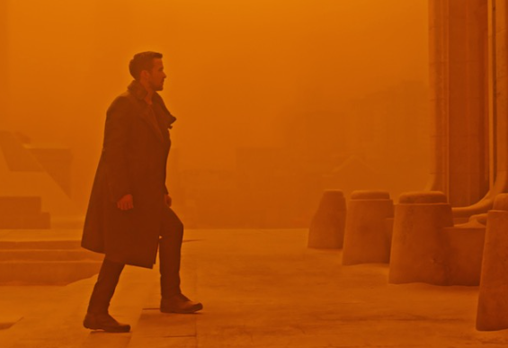
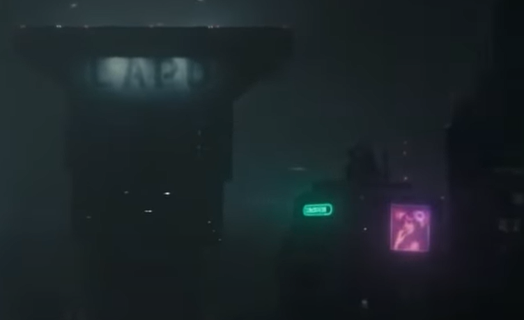
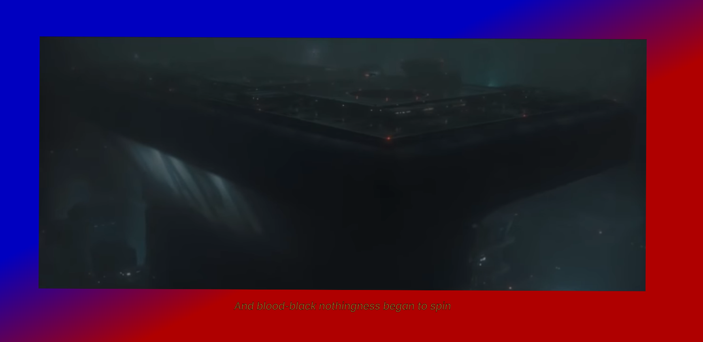

# Sounds for the Deaf

* Author: Jasper Riepe
* Student code: 500821485
* Amsterdam University of Applied Sciences
* project finished: 26th of october 2022

Copying and sharing this document is not allowed. Contact the author if you want to use any information found within this readme or code files.

---

## Introduction

For us, a movie can be an incredible experience. Watching everything happen on the big screen with all kinds of sound effects and beautiful dialog.
But for people who can't hear a thing, it can be really difficult to understand everything happening on
the screen. There are solutions to this, like simple subtitles, but this can be very boring.
It is up to us students of the minor *Visual Interface Design* to put some extra magic to the simple subtitles.

In this ReadMe file, you will find:

* Research for this project
* Typography
* Nuances
* Different feedback from the teacher and other students
* Testing with users
* My opinion on this subject
* Improvements
* Sources used

When reading, I will talk about a first and second *fragment* of the video. What I mean with this is that there are two main scenes. The first one is from the beginning untill the end of the first interrogation. The second fragment is the second interrogation until the end of the video.

Run the video by placing the html file in your browser. For the best experience, I recommend watching the video first withour any sound. After that rewacth the entire video with the sound on.

---

## The research for this project *(study situation)*

At first I did some research to what is needed for deaf people to get the right feeling from a movie. I searched some documents conserning the rules and guidelines used for this kind of things. In order to make something unique, I wanted to do something that has not been done before. So looking at the guidelines, I could get an image of what to "ignore", deviate from what is convenient.

### Basic rules

Searching on the internet I found several [rules and guidelines](https://www.rev.com/blog/subtitles-blog/sdh-subtitles-for-the-deaf-and-hard-of-hearing) for subtitles for movies. Most of the rules are about the timing. When does a subtitle appear, when does is dissapear, how is it places on the screen? Most of these rules makes subtitles not that interesting. For this project, it is important to kind of ignore those rules and do something completly different *(ignore conventions)*.

What is being subtitled? Next to the voices of the actors, a lot of special effects are being subtitled as well. Think about and extremely huge explosion, underwater bubbles or anything relevant to know what is going on. But sounds not only make a movie spectaculair, they can also have the opposite effect. With sounds you can make a scene interesting, scary or you can build up a lot of tension. And that last one is compelling. Because in the first fragment of the video I'm working on, a high piched tone can be heard. This tone gets worse and worse when more questions follow and than suddenly... it stops. So it is important to give the same fealing to deaf people, to let them know that there is something irritating going on. For this, a simple subtitle won't be enough.

Next, you don't want to make subtitles inaccurate, gibberish or butchered. It has to be relevant to the scenes it's being used to. Seeing all the rules and guidelines for subtitles, I get a pretty good idea what to do different to make a movie for deaf people more interesting. So, in the next chapters I will explain what I did and most importantly why I did it.

## Colors

Colors are very important in movies. They can help us understand the mood of a character, the setting, if there is something going on that we should know, ect. For subtitles and everything I want to make for the deaf, it is important to understand what the directors of this movie wanted to achieve with the different colors they used in their movie.

### Orange

In Blade Runner 2049, orange is used to describe or give a feeling of mystery. For example in the movie when *agent K* is alking through a abandoned city, the sky and everything around him is orange (see the picture below).  This is the reason why I chose the text to be orange. We don't know why *agent K* is doing this interrogation. We don't know in what world we are, and what we are going to see. The video is a mystery for us when we watch it for the first time. So the subtitles help to keep it all mysterious.

Orange is also used in the second fragment of the video. When *agent K* doubts his answer, a beep goes of on a computer in the office of a lady. This beep is not too loud, but not too distracting. So I was searching for a color that was not too brigth (like white or yellow) and not too dark (like grey or brown). So I ended up choosing for an orange like color. Like said above, for this lady it is a surprise why her computer beeps. A surprise is a mystery, because you don't know what the surprise is.

### Black

In this movie we are introduced to a distopian world. The whoel city is covered in a dark atmosphere, there is no sunlight to be seen. Because of this dark setting, you get the feeling that this is a mysterious, dark and futuristic world. But when we fly through the city in the first few seconds of the video, you can see all kinds of bright pink and purple neon boards. The pop out very well against the dark buildings and give us a very technical, futuristic feeling. The color tone for the movie is primarily black and gray. These colors give us negative emotions like for example sadness.

I have chosen to keep the background black for two reasons:

* The first reason is that during a movie, you don't want to get distracted by all kinds of lights or anything. Like in de cinema, your focus should be on the screen, not what's next to it. So by keeping the background (most of the time) black, the focus is on the video.
* The second reason is to keep this sadness, dark and mysterious feeling during the entire video. *Agent K* is being questioned and is being yelled at, so there is no time for any happy colors around the video frame.

### White

White, one of the most bright colors used in this movie. The directors chose this color because it represents ruthlesness. And that is exactly what the interrogator is. He doesn't stop asking questions and so is my animation during this interrogation.

The white flashes you see are ment to be irritating and uncomfortable. We don't like to hear the high pitched tone during this scene, a deaf person won't like bright flashes coming of his screen. And as the high pitched tone is getting worse and worse, so does the flashes.

I've used white before for something else. For three times an alarm can be heard. During this alarm I wanted to make clear that something loud and disturbing is going on. So I used a white `box-shadow` which can be seen in the picture below.

But I wasn't satisfied with the result. The beep is more a sort of check going of, as if he said something correct and can carry on. So I tried something new and thought of a way to tell the deaf person that *agent K* is kind of checked in. So I used red and green to do exactly that. On the time stamp of 0:16 seconds the first one can be heard, so if you want to know how it looks know, check the video. Making a screenshot of a animation isn't really practical.

### Red and Blue

I use Red and Blue for my project as indication of the police. The police uses these two colors in a lot of countries around the world, so it is a very reconizable color. For deaf people, they will know that some sort of a siren is being played because of the flashing lights with the colors red and blue. But to make it more clear that it is in fact a police siren that can be heard, I made the two colors rotate around the video. This way the deaf person watching the movie will have two hints to understand what's happening.

### pink

This is a color I only use one time in the entire video, but still worth to mention.

In the second fragment of the video, *agent K* is being questioned again. His boss asks "what's it like... ...someone you love?". The last word is being said with some sarcasm or disgust. In the chapter **Nuances** I will explain my choices with some words more, but to make it clear that the word *love* is being said with some emotion, I used a pink color on the background. I associated pink with love, and I think the deaf person will understand too.

I rather not use white, or blue and red, because I already showed to a deaf person that those colors are being linked to when an alarm can be heard. So it can be confusing if I used white or any other color when he says the word *love*.

---

## Typography

The typography that is used for my subtitles comes from the *Brenner* family. I could have chosen a different font, but the Brenner font gives a lot of different styles to try out and see wich is best for which voice.

### Voice 1

In the first part of the video, I use *Brenner slab* for 'voice 1'. This is because in this fragment, the one who is asking the questions sounds like a boss, a leader who decides what happens to the different people he chats with. That's why I chose to give him a strong, bold style of text. This way a deaf person will know that 'voice 1' is in charge and decides wheter *agent K* will get his bonus or not. And in the second part of the video, he is asking our main character the same questions. Here too is he the boss who asks the questions, and some words even have more emphasis.

 looks like")

### Voice 2

For *agent K* I've chosen to give him a skinnier, weaker text style. The agent is the one that's being questioned. The agent is the one they put in a white room with no chance to do anything but sit there. So he has to be obedient to his boss (or the one questioning him). To make the text submissive, I made is skinnier than 'voice 1' and made is italic to make the difference between the two speaking voices clearer.

So, 'voice 1' who asks all the questions in the first fragment of the video gets *Brenner slab*, and the agent gets *Brenner sans*. To make the difference bigger between the two voices, I made 'voice 2' italic, so it will be easier to understand that it is in fact the other person talking. The typography is used again in the second fragment of the entire video. Using the same typography again, the person who is wathcing will recognize this and will know wich voice is who.

---

## Nuances

A nuance is a difference in or shade of meaning, expression or sound (yes I got that from google). This can be heard in the movie with some sentences and words. I coded some of these words and sentences so a deaf person understands how they are spoken.

* Beginnin with a sentence in the first seconds of the video, spoken by *agent K*. The sentence "Yes sir" are being said as if he is bored, as the thing that is coming is a routine for him. And how to make an emotion clear? By using emoticons! I used a very bored, plain emoji to show that *agent K* doens't actually want to do this. Next to that, have you ever seen an emoji in a subtitle? I don't think so. It is a little surprise, you don't expect it. This way the viewer is interested in seeing the rest of the video.

* A special one is the "*Fuck off, skin job*" when *agent K* walks inside the police station. The person saying it isn't yelling it at him. He almost wispers it into the ear of *K*. To show that it is being wispered, that was a real challenge. I made the entire sentence smaller. The words "fuck off" hurt *agent K* and are being said with some anger, so I made them red. The entire sentence is placed **on** the screen next to *agent K8 his head. This way, it looks like it is being said in his ear, just like you would do when you want to whisper something to someone.

* At the end of the first inetrrogation, *agent K* has to say "within cells interlinked" three times. To show that he says it three times, the sentence becomes bigger when he repeats it.

* Second fragment of the video, time 1:34. The sentence "when you're.. ..Box? Cells.". The word box is being said with some disgust, disrespect. To make focus on the word box, a made a solid border around it.

* Second fragment of the video, time 1:38. When his boss speaks the word *love*, it sounds lovely but full of sarcasm at the same time. So I made the word *love* with a different font style of the Brenner family: `Brenner Script`. And to make it easier to read: `font-style: bold;`.

  

* Last words to mention are at the end of the video where *agent K* repeats some words fast after each other (Dreadfully distinct and Dark). There is some power behind these words so I simply made them bigger.

---

## Different feedback

In the past two weeks of this project, I got several points of feedback on what I was making.
From other students, I got the ideas to listen more to *how* they say some words in the video. This way I can listen if any word is being said with any emotion. If so, I can change the typography, color or anything else to make a deaf person think 'hey, this is being said differently, is thas to be important'. Further more, don't do the convenient. Normally, you want to make these things as you know them yourself. But now we need to look at subtitles in a whole different way. And that is exactly what my teacher told me. Make it more extreme, more expressive, make it as weird as you want. But, watch out to not overdo it. And with the nuances and different words: listen to how they say it. In the first fragment, the person (or machine) asking the questions doesn't put much emotion in the sentences. But in the second fragment, for example 'love', the word is being sad with a sort of aversion. And that is exactly the emotion you want a deaf person to recieve while reading that subtitle.

In the week before my project would be rated, I got some last points of feedback. For example I needed to check the contrast between my text and the background. I fixed this by adding a black background behind the text to make it visible at all times. A second tip was to add sounds myself. This could easily be done by going to the `sounds.js` file and adding some time stamps. When I figured out how this worked, a whole new world opened up for me.

These were the most interesting points of feedback I've gotten. But I didn't just ask for feedback from students and the teacher. I also asked my family to watch my programmed video and ask for their opinion.

---

## Testing with users

I asked some family members to watch my programmed video. First, I let them watch the video without any sound, just like a deaf person would experience it. Then I would ask them what they thought was happening in the scenes and what kind of feeling they got by watching this. Then, upon answering these questions, I let them rewatch the video. But this time I put on the volume so they could watch it with sound.

The first point of feedback I got was that the text wasn't very easy to read. Before making the text how it is now, there was a white glow coming from the text. I wanted it to look like it was some neon light coming of from the letters. Very nice, but it hindered the viewer from properly reading what was being said. So I removed it an made the text a little bigger and bolder.

Furthermore I changed somthing I already talked about before: Bright white lights coming from behind the video when an alarm is ringing. My test subjects were not completely convinced it was an alarm until they heard the sound. So I changed it and had them listen to it again. This time they understood what was going on.

Last but not least was feedback on something I didn't yet do. That was the idea to put a 'sort of bright light which serves as a scanner' on the screen. This sounds confusing, but they ment a `linear-gradient` that went from the left side of the screen to the right side on time stamp 2:00 (see picture below).

## My opinion on this project

The past two / three weeks were incredible. I've learnt so much about coding with CSS. I really like it and want to explore more about it. This project was the perfect way to learn how coding works and how CSS, HTML and a little Java Script works.

This project was an initiative from the subject *Web Typography* from the study *Communicatie en Multimedia Design*. I'm originally from the study *Engineering* and I have never done this coding before. It was really scary to begin with this project, because I didn't even know where and how to start. I asked for a lot of help and after a few days I started to recognize different things and I started to understand what was going on. It was really cool to learn something new and this will definetly come in handy for the rest of the minor *Visual Interface Design*.

## Improvements

As always, if I was given more time I could have done more. For example:

* I wanted to make the flashing part during the first interrogation more irritating and better timed. I also wanted to make the screen wobble, but because of lack of knowledge, I don't know how to code such thing.

* The second thing a wanted to do is come up with an idea how to visualise the synthesizer you hear in the background in the scon fragment of the video. I did think about an animation of slow moving colors.

* Furthermore is an animation I wanted to add in the beginning of the video, when we are flying through the city for a bit. I was thinking about a little tilt of the screen, or an fully illustrated cockpit as if we are in a flying car flying through the city. That is a little over the top, but still cool if I could make that.

---

## Sources used

### **Some websites used for information about coding**

*Animate.css* | *A cross-browser library of CSS animations*. (z.d.). Geraadpleegd op 26 oktober 2022, van <https://animate.style/>

*animation-duration - CSS: Cascading Style Sheets* | MDN. (2022, 27 september). <https://developer.mozilla.org/en-US/docs/Web/CSS/animation-duration?retiredLocale=nl>

*Beautiful CSS box-shadow examples - CSS Scan*. (z.d.). Geraadpleegd op 26 oktober 2022, van <https://getcssscan.com/css-box-shadow-examples>

Cope, S. (2022, 22 september). *box-shadow*. CSS-Tricks. <https://css-tricks.com/almanac/properties/b/box-shadow/>

Coyier, C. (2018, 26 april). *Radial Gradient Recipes*. CSS-Tricks. <https://css-tricks.com/radial-gradient-recipes/>

Lavicka, M. (z.d.). *ColorSpace - 3 Color Gradient*. Mycolor.space. Geraadpleegd op 26 oktober 2022, van <https://mycolor.space/gradient3?ori=circle>

Westfall, P. (2019, 6 juni). *The easy way to add animations to your website [Animate.css] - PageCloud Blog - Web Design & Small Business Tips for Your Website*. Pagecloud.com. <https://www.pagecloud.com/blog/css-animations>

### **Sources for subtitles for deaf people**

[Analysis of the movie *Blade Runner 2049*, PDF](Paradigm_AS+Vol+1.+No+1-06.pdf)

Jacobs, E. (2022, 23 augustus). *SDH Subtitles: Guide to Subtitles for the Deaf and Hard of Hearing. Rev*. <https://www.rev.com/blog/subtitles-blog/sdh-subtitles-for-the-deaf-and-hard-of-hearing>

*Subtitling for deaf and hard-of-hearing people*. (2014, 9 december). Media Translation and Accessibility in the EU. <https://mediatranslationandaccessibilityineu.wordpress.com/accessibility/>

---

Thanks for reading this readme
